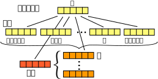

# 文間及びカテゴリ間の関係性を捉えたレーティング予測

豊田工業大学 知能数理研究室 学部4年 外山洋太


## 背景と目的

<!--
 近年、企業においてビッグデータを活用した商品の評判分析の必要性が高まっている。
その中でも商品レビューの評判分類は重要な問題である。
-->

企業において商品の評判分析のためのレビューの評判分類は重要な問題である。
何万件という大量のレビューデータを人手で処理することは難しく、
計算機による自動化が望まれる。
その中で商品を複数のカテゴリにおいて分類をする問題がある。
カテゴリとは、宿泊施設のレビューを例にすると、サービス、立地、食事等の
レーティングが付けられる各項目のことである。
この問題に関する既存手法[1]は、文間の関係性を考慮しておらず、
カテゴリ間については考慮しているものの深い関係性を捉えることができていない。

近年、その評判分類において、畳み込みニューラルネットワーク(CNN)を用いた手法が
提案されており、従来の手法を上回る分類精度を達成している。
ニューラルネットワーク(NN)を分類問題に用いることの利点の一つは
層の数を増やすことによって
入力となる特徴量の深い意味を捉えることができることである。
多カテゴリの分類問題に適用すれば、 カテゴリ間の関係性を捉えた分類が実現できる。
さらに、文毎の特徴量を入力とすれば文間の関係性も捉えることができる。

文や文章の特徴量としては、パラグラフベクトル(PV)[2]が分類問題に対して
優れていることが示されている。

以上より、本研究では、複数カテゴリにおける評判分類について、
パラグラフベクトルとCNNを用いて文間及びカテゴリ間の関係性を捉えた分類を実現し、
従来手法から分類精度を向上させることを目的とする。


## 関連研究

### 隠れ状態を用いたホテルレビューのレーティング予測

藤谷ら[1]は複数のカテゴリにおける評判分類問題に対して、
レビュー内の各文毎に隠れレーティングを予測することで
評判分類の精度を向上させる手法を提案している。


### パラグラフベクトル

パラグラフベクトルは、文や文章といった大きな単位の言語表現の意味表現を
学習する手法である。
これは、Continuous Bag Of Words (CBOW)という単語の意味表現の
学習手法を応用した手法である。

以下に具体的なアルゴリズムを示す。
ここでは簡単のため文の意味表現を学習する場合について考える。
まず、意味表現を学習する対象となる文に含まれる単語を
初めから一つずつ読んでいく。
その際、以下の式1に示す目的関数を最大化するように各パラメータの学習を行う。

<!--
現在の単語とその周辺の単語及び現在の文を含む
-->

```
\begin{gather}
  L = \frac{1}{T} \sum^{T - k}_{t = k} \log p(w_t | w_{t-k}, ..., w_{t+k}; d)
  p(w_t | w_{t-k}, ..., w_{t+k}; d) = \frac{e^{y_{w_t}}}{\sum_i e^{y_i}}
  y = b + Uh(w_{t-k}, ..., w_{t+k}, d; W, D)
\end{gather}
```

ここで,



図XXX. 文書及び文ベクトルの学習の概略

<!--
単語の意味表現と同時にその単語の属する文や文章の意味表現を同時に
学習する。このとき、
-->


### 畳み込みニューラルネットワークを用いた評判分類

Nal Kalchbrenner et al.やRie Johnson et al.が
畳み込みニューラルネットワークを用いた評判分類を提案している。
これらの手法は従来の手法を超える精度を達成している。


## 提案手法

提案手法では、パラグラフベクトルによってレビュー内の各文及び文章の分散表現を
生成し、それらをニューラルネットワークの入力として分類を行う。


### アイデア

先行研究[1]の実験結果から、
レビュー内の各文の特徴量を元にレビューの分類を行うことが
分類精度の向上に有効であると考えられる。
また、カテゴリ間の繋がりの変化が分類精度に影響していることから、
これをパラメータとして機械学習のモデルに組み込めば
分類精度を向上させることができると考えられる。

さらに、レビュー内の各文毎に分散表現を生成し分類器の入力とすることで、
その順序を考慮した学習を行う。
これにより、レビューの文章の大まかな文脈の流れが分類に利用できると考えられる。


### アルゴリズム


## 実験

基準手法及び提案手法について分類精度を測定するために実験を行った。
全ての実験には、先行研究[1]と同様に、
ホテル予約サイト楽天トラベルにおけるレビュー337,266件から
訓練データ300,000件、開発データ10,000件、評価データ10,000件を用いた。


### 基準手法の実験

#### 実験設定

基準手法として、NNへの入力となる特徴量が異なる2つの手法を用いた。
一つは各レビューに対する文書ベクトルのみを特徴量として用いたものである。
もう一つはコメントの文書ベクトルに加え
コメント内の各文に対する文ベクトルの平均ベクトルを用いたものである。
一つ目と2つ目の基準手法の比較によって、
文書ベクトルに加え文ベクトルを用いることが有効であるかが示される。
2つ目の基準手法と提案手法の比較によって、
文の並び及びコメントの全体的なストーリーが分類に対して重要であるかが示される。

表XXXと表XXXに各手法でのパラメータ設定を示す。

表XXX. 文書ベクトルのみを用いた手法のパラメータ設定

項目                                  | 値
--------------------------------------|----------
学習する単語の範囲                    | 前後3単語
単語の最少出現回数                    | 5
ベクトルの次元数                      | 600
中間層の数                            | 1
中間層でのニューロン数                | 512
入力層及び中間層でのドロップアウト率  | 0.2, 0.5

表XXX. 文書ベクトルのみを用いた手法のパラメータ設定

項目                                  | 値
--------------------------------------|----------
学習する単語の範囲                    | 前後3単語
単語の最少出現回数                    | 5
ベクトルの次元数                      | 600
中間層の数                            | 1
中間層でのニューロン数                | 512
入力層及び中間層でのドロップアウト率  | 0.2, 0.5


### 結果

表XXXに実験結果を示す。

表XXX. 実験結果

手法                                            | 精度
------------------------------------------------|------
文書ベクトルのみを用いた手法                    |
文書ベクトル及び平均した文ベクトルを用いた手法  |

#### 考察

表XXXより、


### 提案手法の実験

#### 実験設定

提案手法の分類精度を測定した。分類精度


### 結果


#### 考察


## 結論

本研究では、レビュー全体の分散表現に加え、
レビュー内の各文に対する分散表現の重み付き平均を用いた
評判分類の手法を提案した。

実験により、従来手法[1]及びレビュー全体の文書ベクトルのみを用いた手法に比べ、
提案手法が高い分類精度を示すことが分かった。
同時に、これはレビュー内の文の並びが評判分類に重要であることを示す。


## 今後の課題

提案手法は、分類すべき文書とそれが含む文の分散表現を生成する段階、及び、
それらの分散表現を用いて分類を行う段階の2つの段階に分かれている。
このことは、問題を2つに分けることで個々の問題単純にしているが、
同時にオンラインに文書の分類を行うことを難しくしている。
また、提案手法において、文書や文の分散表現を事前に生成するための
パラグラフベクトルの手法におけるパラメータは、
実際には最大の分類精度を達成するため分類器のパラメータとして最適化されることが
望ましい。このためには


###### 参考文献

1. 藤谷宣典ら,
    隠れ状態を用いたホテルレビューのレーティング予測.
    言語処理学会第21回年次大会, 2015.
2. Quoc Le, and Tomas Mikolov,
    Distributed Representations of Sentences and Documents.
    ICML 2014, 2014.
3. Nal Kalchbrenner, Edward Grefenstette, and Phil Blunsom,
    A Convolutional Neural Network for Modelling Sentences.
    ACL 2014, 2014.
4. Rie Johnson, and Tong Zhang,
    Effective Use of Word Order for Text Categorization with Convolutional
    Neural Networks.
    NAACL 2015, 2015.
5. Duyu Tang, Bing Qin, and Ting Liu,
    Learning Semantic Representation of Users and Products for Document Level
    Sentiment Classification.
    ACL 2015, 2015.
